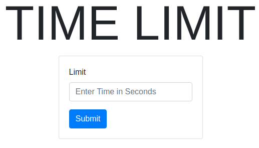
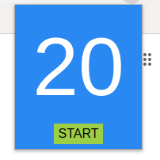

# Timer

  

## To Load the extension locally follow the steps:
- Clone or Download the repository.
- Open chrome extensions _chrome://extensions/_
- Turn on the developer mode from top right corner.
- Click on load unpacked and upload the clonned/downloaded **folder**.

## How to use it? 
_Instructions_ are pretty simple:
- On top right corner you can see the extension Icon.
- Right Click on it select options.
- Fill setting of your choice and submit .

  

- Click on START button to begin a Timer!!!.

 

 

:construction: **Might add more updates in future** :construction:
